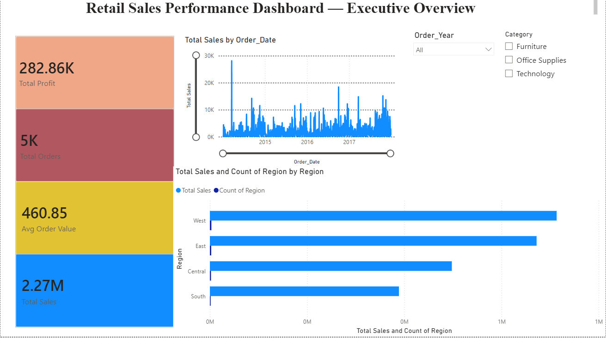
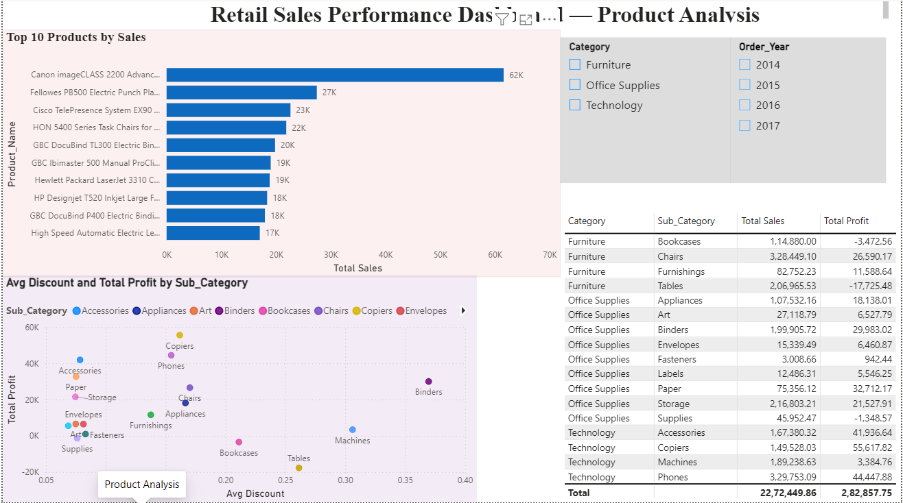
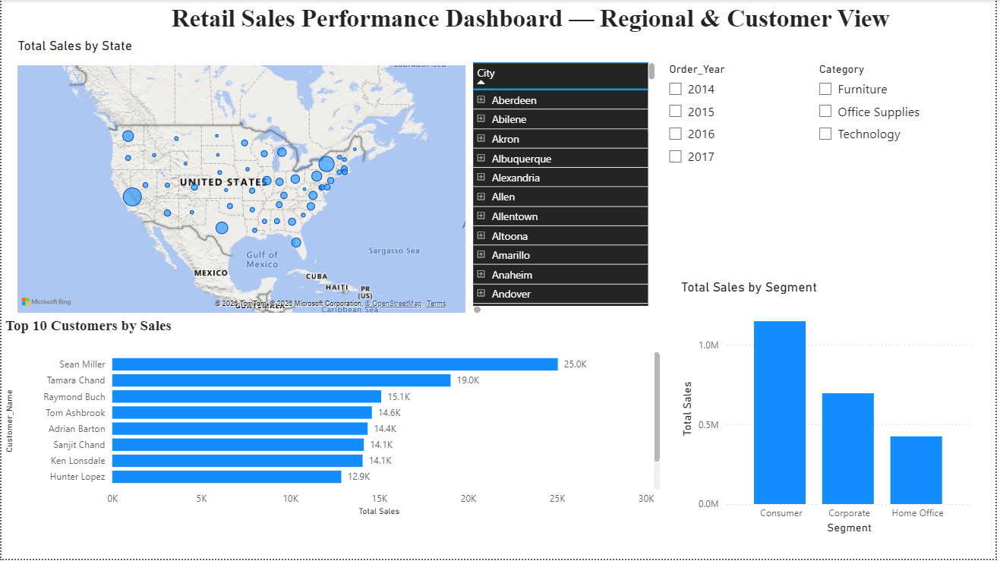

# Retail Sales Performance Dashboard

An end-to-end data analytics project that cleans, models, and visualizes retail sales data to uncover revenue trends, profitability issues, and regional/customer performance patterns.

## 🎯 Problem Statement
Retail businesses often can't easily answer: which products/regions drive profit, and which are quietly losing money despite high sales? This project analyzes ~10,000 transactions from a superstore to answer:
- What are our overall sales, profit, and order trends?
- Which products, categories, and regions perform best (and worst)?
- Is discounting hurting profitability?
- Which customers and segments contribute most to revenue?

## 🛠️ Tools Used
- **Python (Pandas)** — data cleaning and preprocessing
- **MySQL** — data storage and SQL analysis (aggregations, grouping)
- **Power BI** — interactive 3-page dashboard with DAX measures

## 📊 Dataset
Superstore Sales Dataset (Kaggle) — [link](https://www.kaggle.com/datasets/vivek468/superstore-dataset-final)
~10,000 rows covering Orders, Customers, Products, Regions, Sales, Profit, and Discounts (2014–2017).

## 🔄 Process
1. **Data Cleaning (Python):** Fixed inconsistent date formats, removed duplicates, engineered new columns (Order Month/Year, Profit Margin %)
2. **SQL Modeling:** Loaded cleaned data into MySQL; wrote analytical queries covering top products, regional profit, category/sub-category performance, and discount impact
3. **Dashboard (Power BI):** Connected directly to MySQL, built DAX measures (Total Sales, Total Profit, Profit Margin %, Avg Order Value), and designed a 3-page interactive report

## 📈 Key Insights
- **West region generates the highest sales**, followed closely by East, while Central and South trail behind — suggesting an opportunity to investigate underperformance in Central/South markets.
- **Furniture sub-categories (Tables, Bookcases) are revenue-positive but profit-negative** — Tables alone generated ₹2.07L in sales but lost ₹17.7K in profit, driven by discounts averaging 25-30%. High-performing sub-categories like Copiers and Phones stay profitable at lower discount levels, pointing to a clear "over-discounting" problem in Furniture.
- **Revenue is not overly concentrated** — the top 10 customers account for roughly 6-7% of total sales, indicating healthy customer diversification rather than dependency on a few large accounts.
- **Consumer segment drives the majority of sales** (over 2x Corporate and Home Office combined), making it the primary segment to prioritize for retention and marketing.
- **Overall company profit margin sits around 12.4%**, with clear room for improvement by tightening discount policy on Furniture.

## 📷 Dashboard Preview

### Executive Overview


### Product Analysis


### Regional & Customer View


## 📁 Repo Structure
```
retail-sales-dashboard/
├── data/
│   └── cleaned_superstore.csv
├── clean_data.py
├── sql_queries.sql
├── dashboard_screenshots/
│   ├── page1_overview.png
│   ├── page2_products.png
│   └── page3_regional.png
├── Retail_Sales_Dashboard.pbix
└── README.md
```

## 🚀 Resume Summary
Built an end-to-end retail sales analytics pipeline — cleaned 10,000+ transaction records with Python/Pandas, modeled data in MySQL, and developed an interactive 3-page Power BI dashboard revealing a Furniture profitability gap driven by over-discounting and identifying Consumer segment as the primary revenue driver.
